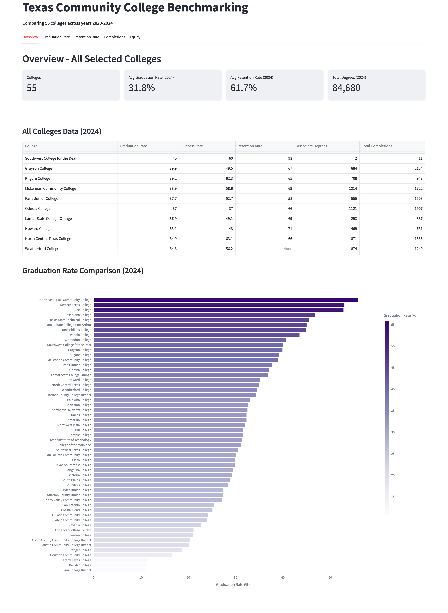

# Texas Community College Benchmarking

A dbt project for benchmarking Texas community colleges using IPEDS data. Supports HB8 equity reporting, multi-year trend analysis, peer comparisons, and student outcome analytics.

Everything runs **locally against [DuckDB](https://duckdb.org/)** — no cloud data warehouse required.

## Project Structure

```txt
texas_cc_benchmarking/
├── models/
│   ├── staging/          # Clean raw IPEDS data (2020-2024)
│   ├── intermediate/     # Business logic and transformations (Multi-year)
│   └── marts/            # Analytics-ready tables (Multi-year)
├── seeds/                # Raw IPEDS CSVs (2020-2024), read as views by DuckDB
├── macros/               # create_raw_ipeds_views: exposes the CSVs as the raw_ipeds source
└── profiles.yml          # Local DuckDB connection (no secrets)
dashboard/                # Streamlit dashboard
scripts/                  # IPEDS download utility
```

## Data Models

### Staging Layer

Raw IPEDS data cleaned and renamed for the 2020-2024 period:

| Model                         | IPEDS Survey | Description                            |
| ----------------------------- | ------------ | -------------------------------------- |
| `stg_ipeds__institutions`     | HD           | Institution characteristics            |
| `stg_ipeds__enrollment`       | EFFY         | 12-month enrollment by demographics    |
| `stg_ipeds__completions`      | C_A          | Awards/degrees by CIP code             |
| `stg_ipeds__financial_aid`    | SFA          | Pell grants, loans, aid                |
| `stg_ipeds__graduation_rates` | GR           | Graduation rates by cohort             |
| `stg_ipeds__retention_rates`  | EF_D         | Retention rates, student-faculty ratio |

### Intermediate Layer

Reusable building blocks with multi-year business logic:

| Model                          | Description                                               |
| ------------------------------ | --------------------------------------------------------- |
| `int_texas_community_colleges` | Filters to Texas public 2-year institutions               |
| `int_peer_groups`              | Peer groupings by size, HSI status, Pell tier, urbanicity |
| `int_completion_metrics`       | Multi-year aggregated completions by institution          |
| `int_graduation_rates`         | Multi-year 150% graduation rates with equity gaps         |
| `int_retention_rates`          | Multi-year FT/PT retention with blended rate              |

### Marts Layer

Analytics-ready tables for reporting across multiple years:

| Model                    | Description                                                                               |
| ------------------------ | ----------------------------------------------------------------------------------------- |
| `dim_texas_institutions` | Institution dimension with all attributes                                                 |
| `fct_student_outcomes`   | Multi-year fact table (2020-2024) combining completion, graduation, and retention metrics |
| `rpt_peer_comparison`    | Benchmark institutions against peer group averages                                        |
| `rpt_equity_dashboard`   | HB8 equity gaps and completion equity indices                                             |

## Quick Start

### Prerequisites

- Python 3.12
- [uv](https://github.com/astral-sh/uv) for dependency management

### Install dependencies

This project uses [uv](https://github.com/astral-sh/uv). From the repo root:

```bash
curl -LsSf https://astral.sh/uv/install.sh | sh   # if you don't have uv yet
uv sync
```

That installs everything you need: `dbt-duckdb`, `duckdb`, `pandas`, `plotly`,
`requests`, and `streamlit`.

### Build the data

The raw IPEDS CSVs (2020-2024) are already committed under
`texas_cc_benchmarking/seeds/`. dbt reads them directly as DuckDB views (via the
`create_raw_ipeds_views` macro / `on-run-start` hook), so there is **no separate
load step** — just build:

```bash
cd texas_cc_benchmarking
uv run dbt deps      # first time only: installs dbt_utils
uv run dbt build     # builds all models, runs tests
```

This creates `texas_cc.duckdb` in the `texas_cc_benchmarking/` directory with all
staging, intermediate, and mart tables. Verify the connection any time with:

```bash
uv run dbt debug     # should print "All checks passed!"
```

> The DuckDB connection is configured in `texas_cc_benchmarking/profiles.yml`
> (`type: duckdb`, `path: texas_cc.duckdb`). dbt picks it up automatically when run
> from inside the project directory — no `~/.dbt/profiles.yml` needed.

### (Optional) Refresh the raw data

To re-download fresh IPEDS files into `seeds/`:

```bash
uv run python scripts/download_ipeds.py --years 2020 2021 2022 2023 2024 --filter-texas
```

Then re-run `dbt build`.

## Analytics Dashboard



Launch the Streamlit dashboard for interactive multi-college comparison. It reads
the local `texas_cc.duckdb` produced by `dbt build`:

```bash
uv run streamlit run dashboard/app.py
```

By default the dashboard opens `texas_cc_benchmarking/texas_cc.duckdb`. To point it
at a different database file, set the `DUCKDB_PATH` environment variable.

### Key Features

- **Multi-Year Analysis**: View trends across 2020-2024.
- **Multi-College Comparison**: Select and compare multiple institutions side-by-side.
- **Metric Tabs**: Dedicated views for Graduation Rates, Retention, Completions, and Equity metrics.
- **Slicer Sidebar**: Easy-to-use checkbox list for selecting institutions with search and "Select All" capabilities.
